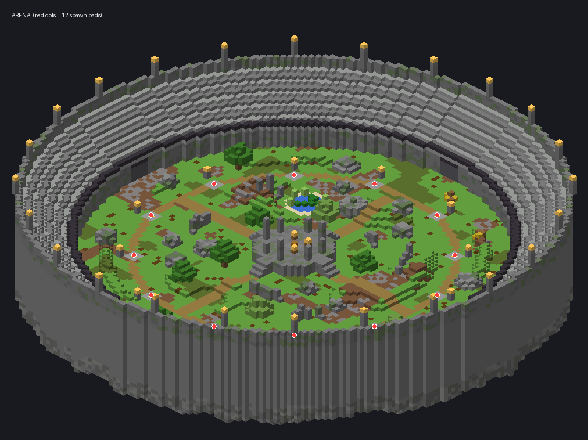
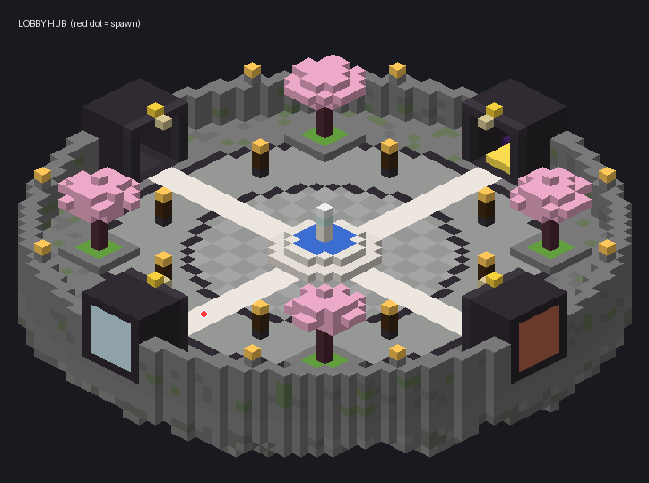

# LmsMaps
Map generator for the Nature7 minigame engine. Builds maps for all four Nature7 games from code and exports them straight into Nature7's maps folder.



## Games
| Game | Map |
| --- | --- |
| `last_standing` | Radius 44 colosseum battlefield, raised ruin in the middle, 2 to 24 spawn pads facing the centre, seeded cover, stands and a lantern rim |
| `spleef` | Round snow floor over a pit inside a ring wall, 2 to 16 spawns. Falling into the pit is out of bounds |
| `skywars` | One floating island per player (2 to 12) with a chest, around a bigger centre island with 4 chests |
| `capture_the_flag` | Walled field with a red base at one end and a blue base at the other, flag pedestals, team spawns and mirrored cover |

## Themes
Every game can use every theme. The layout stays the same, only the blocks change.

| Theme | Look |
| --- | --- |
| `colosseum` | Grass battlefield, stone brick colosseum, water pond, oak and birch |
| `desert` | Sand and red sand, sandstone walls, oasis pond, acacia and jungle trees, cactus |
| `snow` | Snowfield with ice patches, deepslate walls, frozen pond, spruce trees |
| `nether` | Crimson and warped nylium, nether brick walls, lava pond, fungus trees, soul lanterns |

## Commands
Op or `lmsmaps.admin`. `seed` and `theme` both take `random`, and without a theme `default-theme` from `config.yml` is used.

| Command | Does |
| --- | --- |
| `/lmsmap export [game] <id> [players] [seed] [theme]` | Builds a map in a temporary void world and exports it as a Nature7 map. The game defaults to `last_standing`. Works from the console |
| `/lmsmap arena [players] [seed] [theme]` | Builds an arena where you stand |
| `/lmsmap hub [seed]` | Builds the lobby hub where you stand |
| `/lmsmap tp <hub\|arena>` | Teleports to a built map |
| `/lmsmap info` | Shows what's been built |

## Exporting to Nature7
`/lmsmap export capture_the_flag dunes 10 random desert` writes:
```
plugins/Nature7/maps/capture_the_flag/dunes/
  map.yml        name, authors, spectator-spawn, bounds and the game's points (spawns, chests, flags)
  world/region/  the map's chunks
```
Nature7 picks the folder up on its next start and adds it to the map vote. The folder format is the only link between the two plugins, so Nature7 never depends on this one. `maps-folder` in `config.yml` points at Nature7's maps folder.

## Building in a world
`hub` and `arena` build on the block under your feet and clear a cylinder around it (hub about 29 blocks, arena about 58), so use a void or flat world, or build high up. Spawns, regions and the arena radius are saved to `config.yml` for game code, and stepping on the hub's gold PLAY pad runs `join-pad.command`.



## Running it
```
./gradlew build      # build/libs/lms-maps-1.0.0.jar, needs Java 25 and Paper 26.2
./gradlew test
./gradlew runServer  # dev server on port 25568
```

## Code
- `gen/` has no Bukkit dependency: `BlockBuffer` is an in-memory schematic, one generator per game plus `HubGenerator` fill it, `GameKind` maps Nature7 game ids to generators, `Theme` is the block palette and `Geo` has the noise and facing helpers
- `BuildTask` places a buffer a few thousand blocks per tick: clear, solid blocks bottom up, then fragile ones (plants, lanterns, fluids), then sign text
- `MapExporter` builds into a void world, copies the chunks out and writes `map.yml`
- Tests pin the colosseum output with a fingerprint so old seeds keep giving the same map, check every game and theme against the real block registry, and check the exported `map.yml` keys match what Nature7 reads
